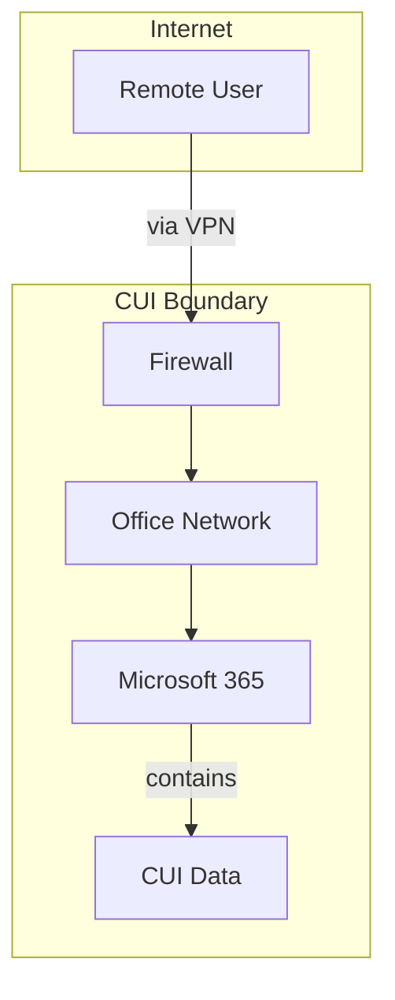

## CMMC OS: Onboarding Wizard Redesign Architecture (v2)

### 1. The Core Problem: From Selection to Interview

The current onboarding wizard relies on a user selecting technologies from a list. This assumes the user knows what technologies they have and which ones are relevant to CMMC. For our target persona, Brenda, this is a flawed assumption. She knows *what her company does*, not *what it runs*.

The redesign reframes onboarding from a technical selection process to a guided **scoping interview**. The wizard asks plain-English questions about the business, and the platform translates the answers into a technical boundary profile.

### 2. The Scoping Interview Architecture

This replaces the current `BoundaryProfileSelector` with a new multi-step modal component, `BoundaryScopingInterview.tsx`.

**Data Flow:**
1.  The interview presents a series of questions with multiple-choice answers.
2.  The user's answers are stored in a temporary state object.
3.  On completion, the answers are sent to a new API route: `POST /api/boundary/profile-from-interview`.
4.  This API route contains the business logic to map the interview answers to the structured `boundaryProfile` object (the same one the rest of the platform uses).
5.  The resulting `boundaryProfile` is saved to the database.

**The Interview Questions (Illustrative Examples):**

-   **Question 1: Where do your employees work?**
    -   [ ] In our company office
    -   [ ] Remotely (from home, etc.)
    -   [ ] Both in the office and remotely
-   **Question 2: How do you store and share files?**
    -   [ ] Microsoft 365 (SharePoint, OneDrive, Teams)
    -   [ ] Google Workspace (Google Drive)
    -   [ ] A server in our office (a "network drive")
    -   [ ] Other cloud storage (e.g., Dropbox)
-   **Question 3: How do you manage user accounts and passwords?**
    -   [ ] We use Microsoft accounts (the same login for Windows and email)
    -   [ ] We use Google accounts
    -   [ ] We have a server in the office that manages logins (Active Directory)
    -   [ ] We use a service like Okta
-   **Question 4: What kind of computers do your employees use for work?**
    -   [ ] Windows laptops/desktops
    -   [ ] Apple Mac computers
    -   [ ] Both Windows and Macs

This is not an exhaustive list. The full prompt will define the complete question set required to populate the boundary profile.

### 3. The SVG Boundary Diagram Architecture

This is the payoff for the interview. Once the `boundaryProfile` is saved, the wizard displays a dynamically generated diagram of the user's CUI environment.

**Technology Choice:**
We will use **Mermaid.js** for diagram generation. It is simple, text-based, well-supported, and can be rendered client-side or server-side. The `manus-render-diagram` utility in the sandbox can render Mermaid source to SVG if a server-side approach is chosen.

**Architecture:**
1.  A new API route: `POST /api/boundary/diagram`.
2.  The frontend calls this route, sending the user's saved `boundaryProfile` object in the request body.
3.  The backend contains a function, `generateMermaidSource(profile)`, that translates the structured profile into a Mermaid `graph TD` definition.
    -   It defines nodes for **Users**, **Devices**, **Networks**, **Services**, and **Data Stores**.
    -   It defines edges representing data flow (e.g., `User -- accesses --> M365`).
    -   Crucially, it defines a `subgraph` for the **CUI Boundary**, visually grouping all the components that handle CUI.
4.  The API route calls `manus-render-diagram` with the generated Mermaid source, which produces an SVG.
5.  The API route returns the SVG markup as a string.
6.  The frontend component, `BoundaryDiagram.tsx`, receives the SVG string and renders it directly using `dangerouslySetInnerHTML`.

**Example Mermaid Output (Simplified):**

This architecture makes the abstract concept of a "boundary" tangible and immediately understandable to a non-technical user like Brenda. It validates that the platform understood her answers correctly and gives her a valuable artifact for her own documentation and for the auditor.

### 4. The Control Adjudication Redesign

This redesign focuses on two areas:

1.  **Question-Driven Adjudication:** Instead of a generic "upload evidence" form, the `ControlCardV2` will be enhanced to display a series of yes/no questions for each control. The user's answers will determine the control's status.
    -   A new data structure, `control_adjudication_questions.ts`, will map each control ID to a set of questions.
    -   Example for `3.1.5` (Least Privilege): "Do you have a process to ensure users only have access to what they need for their jobs?" -> "Do you review user access rights regularly?" -> "Do you remove access when an employee leaves?"
    -   Answering "No" to a key question automatically marks the control as `not_implemented` and triggers the POA&M flow.

2.  **Governance Document Checklist:**
    -   The `cmmc_unified_artifact_guide.md` already defines which governance documents are required for each control.
    -   The wizard will be updated to display these as an explicit checklist at the top of the relevant control families (e.g., the Access Control family will have a checklist item for "Access Control Policy").
    -   The `ControlCardV2` for a control like `3.1.2` will be gated. The implementation status cannot be set to `implemented` until the required "Access Control Policy" document has been uploaded. A message will appear: "You must upload your Access Control Policy before you can mark this control as implemented."

This combined approach transforms the wizard from a passive data collection tool into an active, opinionated guide that leads the user to a defensible compliance posture.
